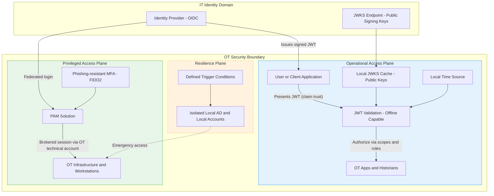

```mermaid
graph TD
    subgraph IT_Domain [IT Identity Domain]
        IDP[Identity Provider - OIDC]
        JWKS[JWKS Endpoint - Public Signing Keys]
    end

    subgraph OT_Domain [OT Security Boundary]
        subgraph OP_Plane [Operational Access Plane]
            Client[User or Client Application]
            KeyCache[Local JWKS Cache - Public Keys]
            Time[Local Time Source]
            TokenValidate[JWT Validation - Offline Capable]
            Apps[OT Apps and Historians]
        end

        subgraph PRIV_Plane [Privileged Access Plane]
            PAM[PAM Solution]
            MFA[Phishing-resistant MFA - FIDO2]
            Servers[OT Infrastructure and Workstations]
        end

        subgraph RES_Plane [Resilience Plane]
            Trigger[Defined Trigger Conditions]
            LocalAD[Isolated Local AD and Local Accounts]
        end
    end

    JWKS --> KeyCache
    IDP -- "Issues signed JWT" --> Client
    Client -- "Presents JWT (claim trust)" --> TokenValidate
    KeyCache --> TokenValidate
    Time --> TokenValidate
    TokenValidate -- "Authorize via scopes and roles" --> Apps

    IDP -- "Federated login" --> PAM
    MFA --> PAM
    PAM -- "Brokered session via OT technical account" --> Servers

    Trigger --> LocalAD
    LocalAD -. "Emergency access" .-> Servers

    style RES_Plane fill:#fff3e0,stroke:#ff9800,stroke-dasharray: 5 5
    style PRIV_Plane fill:#e8f5e9,stroke:#4caf50
    style OP_Plane fill:#e3f2fd,stroke:#2196f3
```
