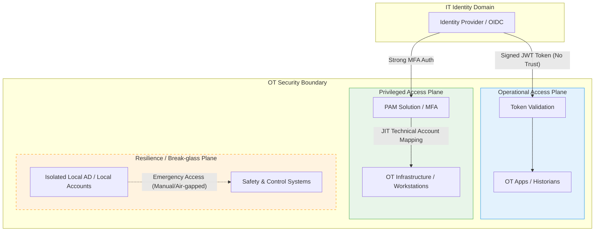

```mermaid
graph TD
    subgraph IT_Domain [IT Identity Domain]
        IDP[Identity Provider / OIDC]
    end

    subgraph OT_Domain [OT Security Boundary]
        subgraph OP_Plane [Operational Access Plane]
            TokenValidate[Token Validation]
            Apps[OT Apps / Historians]
        end

        subgraph PRIV_Plane [Privileged Access Plane]
            PAM[PAM Solution / MFA]
            Servers[OT Infrastructure / Workstations]
        end

        subgraph RES_Plane [Resilience / Break-glass Plane]
            LocalAD[Isolated Local AD / Local Accounts]
            Critical[Safety & Control Systems]
        end
    end

    %% Operational Flow
    IDP -- "Signed JWT Token (No Trust)" --> TokenValidate
    TokenValidate --> Apps

    %% Privileged Flow
    IDP -- "Strong MFA Auth" --> PAM
    PAM -- "JIT Technical Account Mapping" --> Servers

    %% Resilience Flow
    LocalAD -. "Emergency Access (Manual/Air-gapped)" .-> Critical

    %% Styling
    style RES_Plane fill:#fff3e0,stroke:#ff9800,stroke-dasharray: 5 5
    style PRIV_Plane fill:#e8f5e9,stroke:#4caf50
    style OP_Plane fill:#e3f2fd,stroke:#2196f3
```
