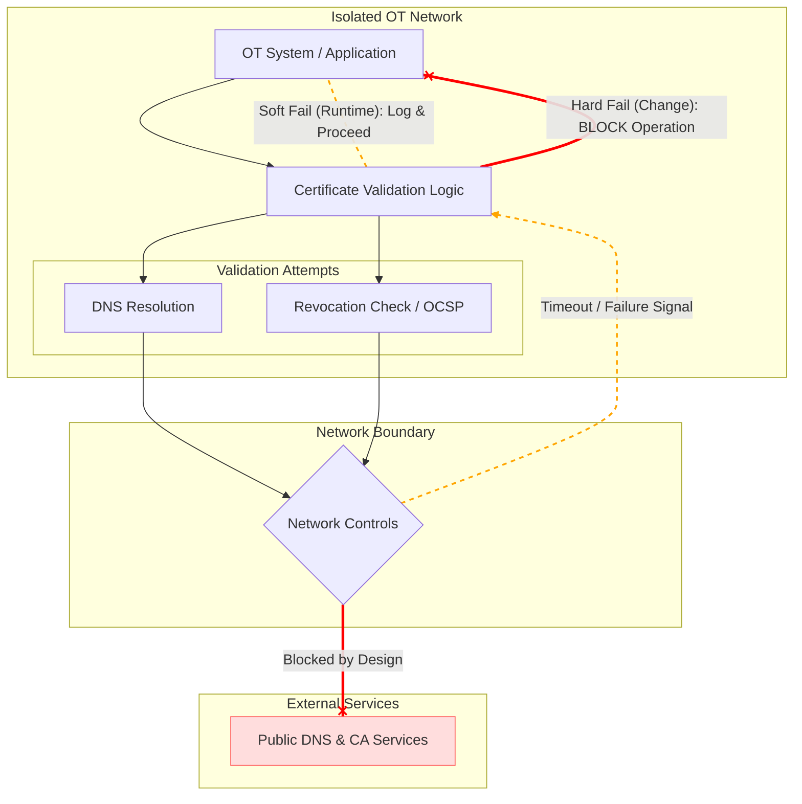

## The Standard Validation Chain

In connected environments, certificate validation assumes that all external dependencies are reachable in near real-time.

In OT environments, these dependencies are often intentionally blocked. The validation logic must then decide how to handle failure, with outcomes that differ significantly between runtime operation and change events.

